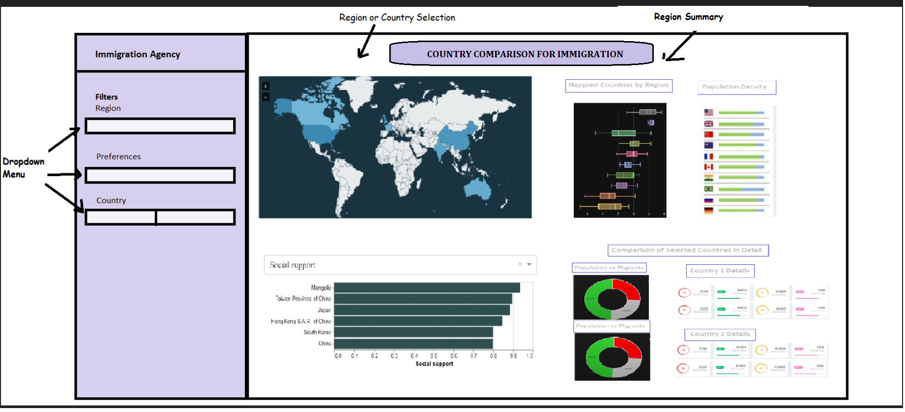

# Country Happiness Visualization App

authors: Deepak Sidhu, Nicholas Wu, William Xu, Zeliha Ural Merpez

## Welcome
Welcome! 🎉  Bienvenue! 🎈 Välkommen 👋

Thank you for visiting the Country Happiness Visualization app project repository. 
  Here is a link to our app: https://immigration-dash-r-app.herokuapp.com/
  Below is what our app looks like in development mode:

This document is a hub for more information about our app. You can click to links in the sections below, or just scroll down to explore.
* [What are we doing?](#what-are-we-doing)
* [Description of our app](#description-of-our-app)
* [App sketch](#app-sketch)
* [Get involved and contact us](#get-involved-and-contact-us)
* [Installation](#installation)

## What are we doing?
Immigration consultant team has helped many clients in order to obtain a happy retirement over the years. With just a few questions on user preferences, we can connect our customers with the perfect match of their retirement paradise within minutes.

There are over 100 countries in the world and it has become more convenient than ever for people to travel to different countries nowadays. Many are looking for an ideal country to settle in for retirement. However, there are too many options and it is hard to select without background information. To facilitate these decision-makings, we propose building an interactive data visualization app that allows customers to visually explore the ranking of countries based on a wide variety of factors, such as GDP per capita, healthy life expectancy, social support and freedom to make life choices, etc. Our app will help customers to find a country that fits their specific needs; a country where they will live happily for the rest of their lives.

## Description of our app
Our "Country Happiness Visualization" app is a dashboard app that has the ability to present customized countries information through a series of data visualization tools such as world map, bar charts, box plot and comparison widget. The purpose of this app is to facilitate country specific decision-making for the user immigration. 

From the dropdown menu on the left side, users can first filter out a specific region (North America, Europe, Asia, Africa, etc.) that they are interested in. Based on the user selection, the app will highlight the region of interest in a world map. The happiness scores calculated for the countries will be displayed in a box-plot, ranked by average. A bar chart of population density within the region that has been chosen will also be presented. In the preference filter, users can select single or multiple factors (GDP per capita, healthy life expectancy, social support, freedom to make life choices, etc.) for comparison among countries. In an interactive bar chart, our app will rank these countries with respect to the preferred metrics that users have selected for analysis. Based on the information, users will select two countries of interest. The app will then visualize the proportion of migrants and make in-depth comparison through pie charts and comparison widgets.

## App sketch

## Get involved and contact us
If you think you can help in helping us develop our dashboard with potential contributions in any of the many areas that we haven't yet thought of, please feel free to check out [contributor's guidelines](CONTRIBUTING.md) and [code of conduct](CODE_OF_CONDUCT.md).
You can also contact [William][link_william] by email.

## Installation
If you would like to install our app and run it locally using ggplotly and Dash-R. We have included an [package requirement file](init.R) for your reference.
- Packages:
  - dash
  - readr
  - here
  - ggthemes
  - remotes
  - tidyverse
  - ggplot2
  - plotly
  - dashCoreComponents
  - dashHtmlComponents
  - dashBootstrapComponents

## Thank you
Thank you so much(Merci beaucoup!Tack så mycket) for visiting out project repository. We hope that you will join us on this fabuluous journey to find the country you love for immigration!

[link_william]: https://github.com/williamxu7
